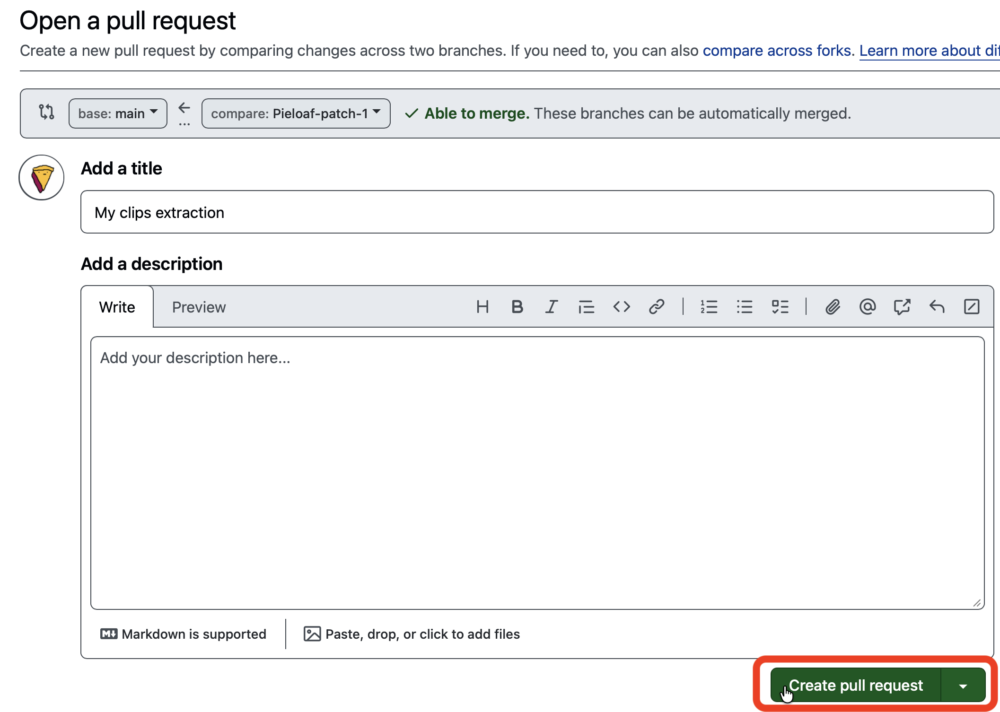

# Banner Saga *.clips Frame Extractor

## How to Use:
### Prepare
1. Gather your `*.clips` files in folder called `clips`

2. Compress the folder to `clips.zip`

### Upload
3. Select `Add file -> Upload files`

4.  - Add your `clips.zip` file and optionally add a message
    - Select `Create a *new branch*` and optionally rename the branch.
    - Select `Propose changes`

5. Select `Create pull request`

### Processing
6. A `workflow` will automatically trigger when the PR opens

7.  - On completion this will turn green (or red in the event of a processing error)
    - Follow the link to download the extracted frames

### Download
8.  - On the `workflow` page, select `Summary` in the top left corner. 
    - You should then see `Artifacts` at the bottom of the page. Here you can download the extracted frames
